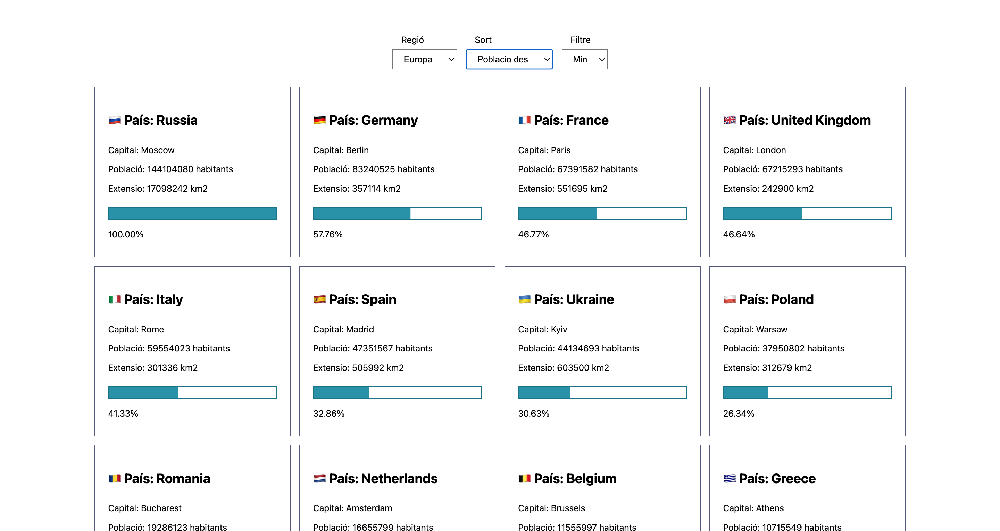

# Ejercicio Continentes

Este ejercicio persigue como objetivo jugar con la API de [restcountries.com](https://restcountries.com/) para jugar y prácticar con los datos que brinda.

El alcance de esta práctica ha sido:
- Filtrar por regiones.
- Ordenar de manera alfabética, por población y por extensión ascendente y descendente. 
- Manejar básicamente un SVG en función de un dato: el porcentaje según el filtro.
- Mostrar de la API: Nombre, Capital, Bandera, Extensión (km2) y Población (hab.)

## Tabla de contenidos

- [Demostración en vivo](#demostración-en-vivo)
- [Características](#características)
- [Tecnologías utilizadas](#tecnologías-utilizadas)
- [Vista previa del proyecto](#vista-previa-del-proyecto)
- [Instalación](#instalación)
- [Autor](#Autor)

## Demostración en vivo

Puedes ver una demostración en vivo del proyecto [aquí](https://albertogarsan.github.io/continentes.github.io/).

## Características

- Interfaz de usuario intuitiva y fácil de usar.
- Filtrado y ordenación
- Manejo de elementos del DOM.
- Práctica básica del manejo de SVG.
- Compatibilidad con dispositivos móviles.

## Tecnologías utilizadas

- HTML5
- CSS3
- JavaScript

## Vista previa del proyecto

## Instalación
Este proyecto no necesita de instalación. Abre la carpeta o haz doble click en el .html

## Autor
**Alberto Garsan (@albertogarsan)**
- [Email](mailto:albertogarsan@outlook.com)
- [Linkedin](https://www.linkedin.com/albertogarciasan)
- [Website](https://www.albertogarsan.com/)

